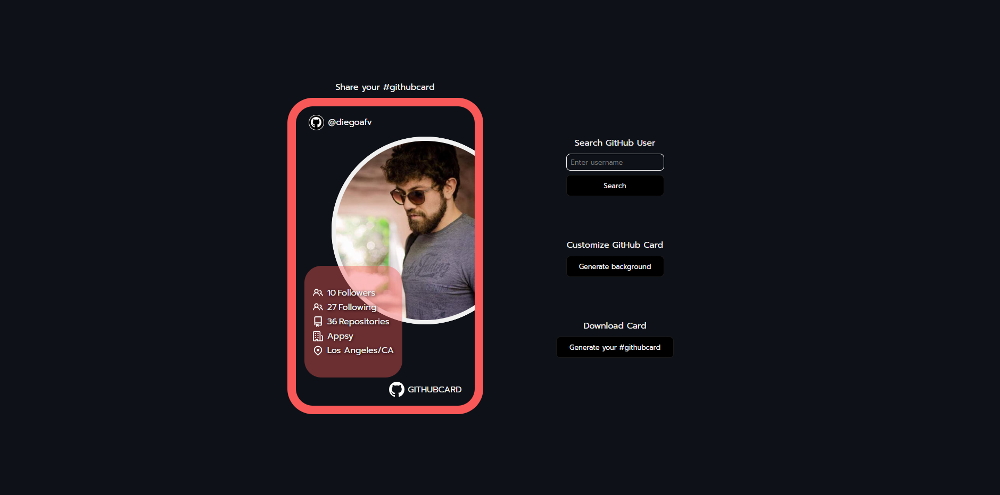

# GitHubCard

Simple application that takes a GitHub user handle and uses GH's API to show a card with user data and profile picture.
The card colors can be customized, generating random options. It also uses html2canvas to download the card as a png image file.
Built using HTML/CSS/JavaScript.

